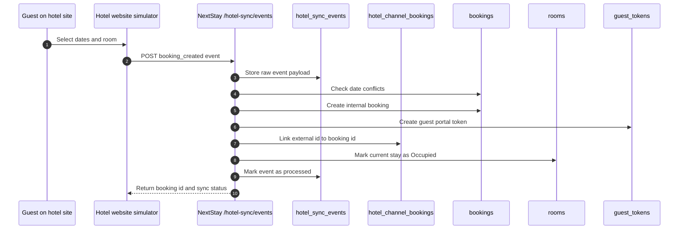
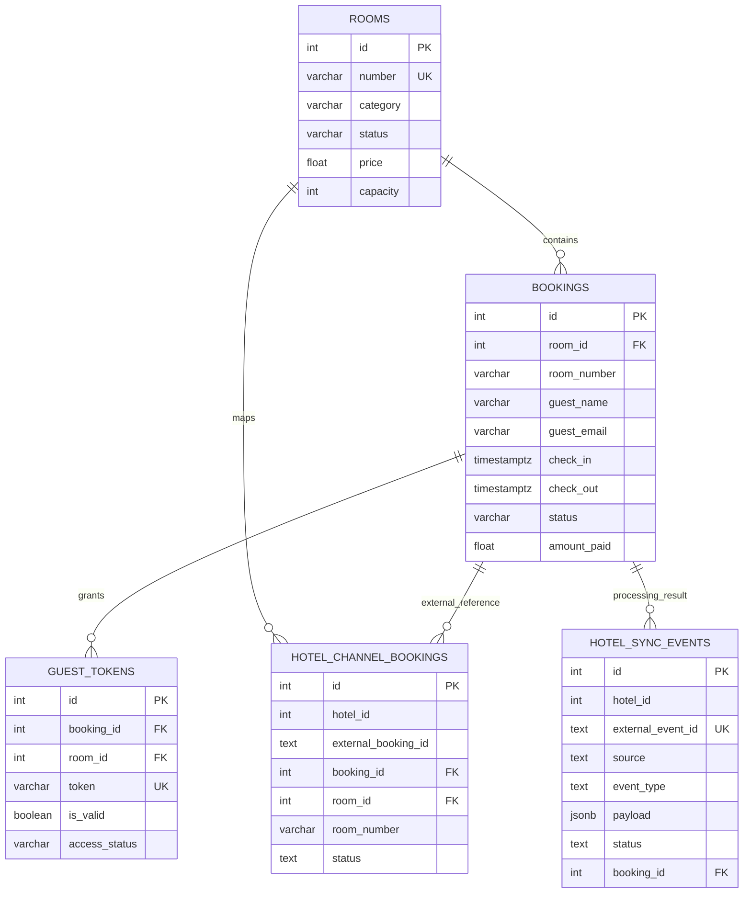
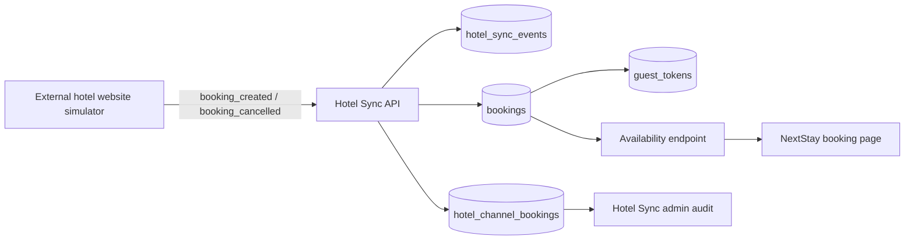

# Hotel Sync Simulator

This module demonstrates how NextStay can receive reservation data from an external hotel website or channel manager and keep the internal room inventory synchronized.

## What was added

- `public.hotel_sync_events` stores every inbound external event with payload, processing state, error text, timestamps, and linked booking id.
- `public.hotel_channel_bookings` maps external booking ids to internal `bookings.id` records.
- `POST /api/v1/hotel-sync/events` receives external events with an `X-Hotel-Sync-Token` header.
- `GET /api/v1/hotel-sync/events` and `GET /api/v1/hotel-sync/channel-bookings` expose the synchronization audit log for managers.
- `/hotel-site-simulator` provides a primitive hotel website booking screen inside the admin app.
- `scripts/simulate_hotel_site_booking.py` sends the same event flow from the command line.

## Supported Events

| Event type | Effect |
| --- | --- |
| `booking_created` | Creates a NextStay booking, guest token, channel mapping, and blocks availability for selected dates. |
| `booking_cancelled` | Marks the mapped booking as `Cancelled`, invalidates guest token access, and releases the room if possible. |
| `room_status_updated` | Updates the room operational status from an external source. |

## Run Migration

```bash
docker exec -i nextstay_db_clean psql -U nextstay -d nextstay < scripts/migrate_add_hotel_sync.sql
```

For a new database, `scripts/init-db.sql` already contains these tables.

## Environment

```bash
HOTEL_SYNC_TOKEN_ENABLED=true
HOTEL_SYNC_TOKEN=dev-hotel-sync-token
VITE_HOTEL_SYNC_TOKEN=dev-hotel-sync-token
```

## CLI Demo

```bash
python scripts/simulate_hotel_site_booking.py --room-number 101
```

Cancel the same external booking:

```bash
python scripts/simulate_hotel_site_booking.py --cancel --external-booking-id CLI-1234567890
```

## Synchronization Flow



## Database ERD



## Component Flow


