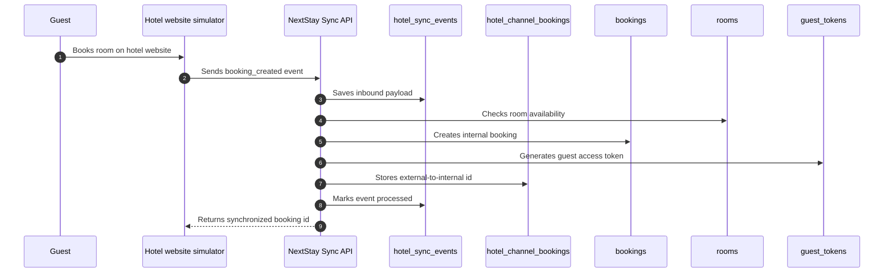
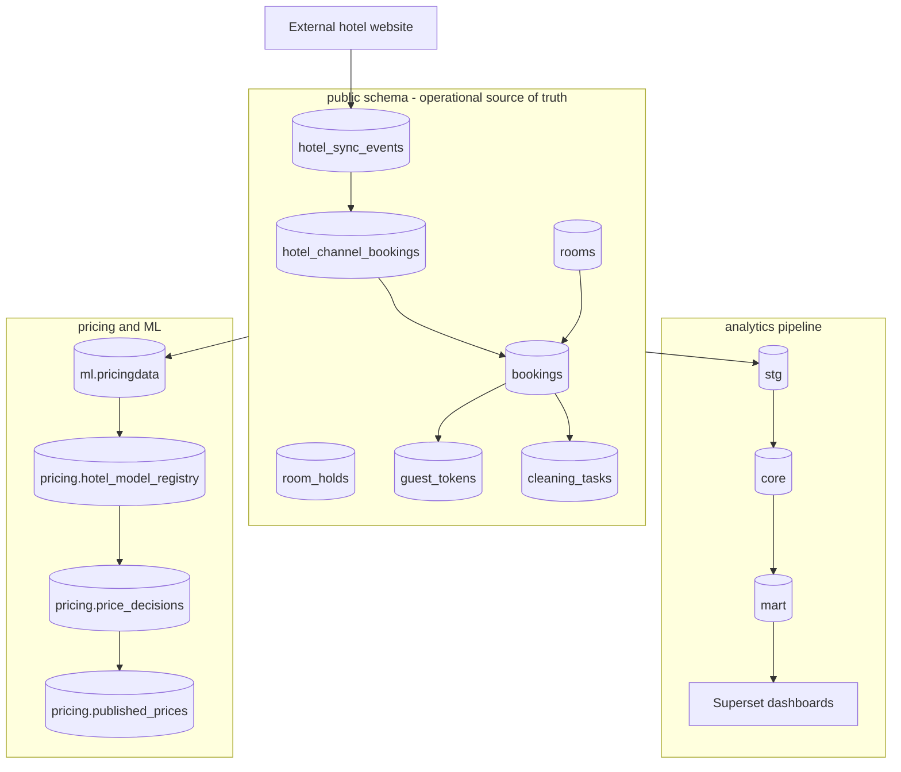
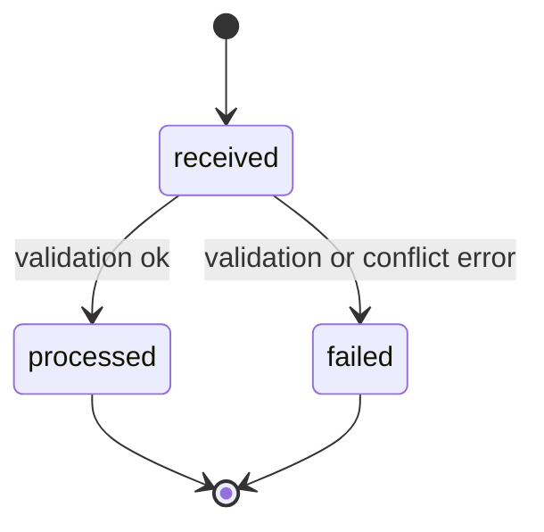

# Report Section: Atai Database Contribution

## Database and Data Architecture Contribution

Atai was responsible for the foundational database layer of NextStay OS. The work covered OLTP schema design, raw SQL migrations, foreign key constraints, indexes, seed data, synthetic datasets for analytics and pricing, and the synchronization layer that connects external hotel booking sources with the NextStay application database.

The database architecture is organized into six schemas:

- `public`: operational source of truth for rooms, bookings, holds, staff tasks, guest tokens, users, authentication sessions, and external hotel synchronization.
- `stg`: staging mirror of operational tables with ETL metadata.
- `core`: dimensional warehouse with hotel, room type, date, and fact tables.
- `mart`: aggregated analytics tables for occupancy, revenue, RevPAR, and loyalty analysis.
- `ml`: feature-engineered pricing datasets used for training.
- `pricing`: dynamic pricing engine tables, model registry, training jobs, price decisions, and published prices.

## Sprint 2 Database Work

Sprint 2 focused on the booking core. The database work included the `rooms`, `bookings`, `room_holds`, and `guest_tokens` tables. `rooms` stores inventory and operational status. `bookings` stores reservation dates, guest details, payment fields, and lifecycle status. `room_holds` supports the 10-minute pre-payment reservation lock. `guest_tokens` enables token-gated guest portal access without requiring guest login.

Indexes were added on `bookings.room_id`, `bookings.stripe_session_id`, `room_holds.room_id`, `room_holds.session_id`, and guest token lookup fields. These indexes support fast room availability search, payment confirmation lookup, hold expiration checks, and guest portal token validation.

## Sprint 3 Database Work

Sprint 3 added the pricing engine database layer. The `pricing` schema includes inventory snapshots, price decisions, published prices, per-hotel pricing configuration, trained model registry, and training job tracking. The `ml.pricingdata` table stores feature-engineered training rows with occupancy, lead time, seasonality, room type, demand, competitor price, and booking outcome signals.

Synthetic dataset generation was added so the pricing engine can be demonstrated even without a large historical production dataset. This supports the diploma requirement to show an end-to-end ML-backed pricing workflow.

## Sprint 4 Database Work

Sprint 4 added staff and task-management persistence. The database includes cleaning task state, priority, assignment fields, staff profiles, and shift scheduling tables. This allows managers to schedule shifts, assign housekeeping work, and track task progress from pending to completed.

## Sprint 5 Database Work

Sprint 5 extended bookings with Stripe payment fields and hardened guest authentication data. `bookings` stores Stripe session id, payment intent id, and amount paid. `email_otps` supports code expiration, attempt counting, and used-code tracking.

## External Hotel Synchronization

To demonstrate synchronization between NextStay and an external hotel website, a hotel channel sync layer was added. The system receives external events, stores every raw payload in `hotel_sync_events`, maps external booking ids to internal bookings in `hotel_channel_bookings`, and updates the operational source-of-truth tables.

When a guest books a room on the hotel website simulator, the simulator sends a `booking_created` event. NextStay validates room availability, creates a booking, generates a guest token, writes the external mapping, and makes the room unavailable for overlapping dates. If the external website cancels the reservation, a `booking_cancelled` event marks the internal booking as cancelled and invalidates guest access.

## Summary of Atai's Deliverables

- Designed and maintained core OLTP tables for inventory, bookings, guest access, tasks, authentication, and synchronization.
- Added raw SQL migrations and bootstrap SQL for repeatable database setup.
- Added foreign keys, uniqueness constraints, check constraints, and performance indexes.
- Built schema separation for OLTP, staging, warehouse, analytics marts, ML, and pricing.
- Added synthetic data generation for pricing model training and dashboard demonstration.
- Added hotel website synchronization tables and simulator flow for external booking ingestion.
