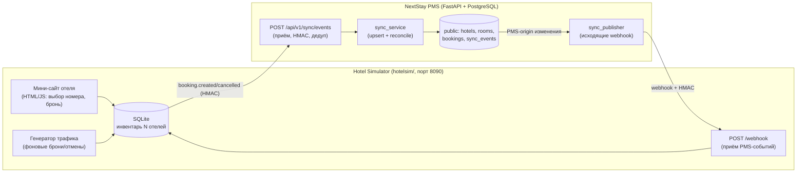

# Hotel Sync Simulator — Design Spec

**Дата:** 2026-06-12
**Автор:** Atai (DB / Data Architecture)
**Проект:** NextStay PMS
**Статус:** утверждён (вариант A)

## 1. Цель

Продемонстрировать двустороннюю синхронизацию между внешними «сайтами отелей» и нашим PMS:
бронь, созданная на стороне отеля, появляется у нас; изменение, сделанное в PMS, уходит обратно отелю.
Сценарий — централизованная система бронирования / channel manager для **нескольких отелей**.

Это новая задача поверх существующего проекта; основная нагрузка спринтов 2–5 уже выполнена.
Зона ответственности — БД-часть (схема, миграции, реестр отелей, журнал событий) + тонкий integration-слой.

## 2. Решения (утверждены)

| Вопрос | Решение |
|---|---|
| Мульти-отель | Да — вводим `hotel_id`, несколько источников-отелей со своим инвентарём (стыкуется с `dim_hotels`) |
| Направление | Двусторонняя: HOTEL→PMS и PMS→HOTEL, с защитой от эхо-петель |
| Транспорт | Webhook (HTTP POST) + подпись HMAC-SHA256 |
| Мини-сайт отеля | Да — примитивный vanilla HTML/JS (внешний сайт, не наш продукт) |
| Архитектура | Вариант A: отдельный сервис Hotel Simulator + реестр отелей в PMS |

## 3. Архитектура



## 4. Компоненты

### 4.1 PMS Sync (наш backend)
- `app/api/v1/sync.py` — роутер:
  - `POST /api/v1/sync/events` — входящий webhook от отелей (проверка HMAC, дедуп, апсерт).
  - `GET /api/v1/sync/events` — аудит-лог событий (для админки/отчёта).
  - `POST /api/v1/sync/hotels` — регистрация отеля (code, name, webhook_url, secret).
- `app/services/sync_service.py` — валидация подписи, дедуп по `event_id`, апсерт брони/статуса номера по `(hotel_id, external_ref)`, проверка овербукинга, простановка статусов.
- `app/services/sync_publisher.py` — отправка исходящих событий на `hotels.webhook_url` (только для `origin=PMS`).

### 4.2 Hotel Simulator (`hotelsim/`)
- Мини-сайт: vanilla HTML/JS — список номеров отеля, выбор дат, кнопка «Забронировать», текущий статус. Без сборки/auth.
- Стор: SQLite с инвентарём нескольких отелей.
- `POST /webhook` — приём PMS-событий → обновление своего стора.
- Генератор трафика — фоновая задача: случайные брони/отмены для живой демонстрации.
- Исходящие: при брони/отмене на симе — подпись HMAC + `POST` на PMS `/sync/events`.

## 5. Модель данных (OLTP `public`)

### Новые таблицы
**`hotels`**

| Поле | Тип | Назначение |
|---|---|---|
| id | serial PK | |
| code | varchar uniq | код отеля (напр. `GRAND_BISHKEK`) |
| name | varchar | |
| webhook_url | varchar | куда PMS шлёт исходящие события |
| hmac_secret | varchar | общий секрет для подписи |
| active | bool | |
| created_at | timestamptz | |

→ питает `core.dim_hotels`.

**`sync_events`**

| Поле | Тип | Назначение |
|---|---|---|
| id | serial PK | |
| event_id | uuid uniq | идемпотентность |
| direction | varchar | inbound / outbound |
| hotel_id | int FK→hotels | |
| event_type | varchar | booking.created/updated/cancelled, room.status_changed |
| entity_type | varchar | booking / room |
| external_ref | varchar | id сущности на стороне отеля |
| origin | varchar | HOTEL / PMS |
| payload | jsonb | сырое тело события |
| status | varchar | received / processed / failed / skipped |
| error | text | |
| created_at | timestamptz | |
| processed_at | timestamptz | |

### Изменения существующих
- `rooms`: + `hotel_id` int FK, + `external_ref` varchar; уникальность `number` → **`UNIQUE(hotel_id, number)`**.
- `bookings`: + `hotel_id` int FK, + `source` varchar ('HOTEL_SITE'/'PMS'), + `external_ref` varchar, + `revision` int default 0.

Реализация: raw-SQL миграции (как в проекте) + обновление SQLAlchemy-моделей.
Бонус DWH: `sync_events` → витрина «производительность каналов» (mart).

## 6. Контракт события

```json
{
  "event_id": "uuid",
  "occurred_at": "2026-06-12T10:00:00Z",
  "type": "booking.created | booking.updated | booking.cancelled | room.status_changed",
  "origin": "HOTEL | PMS",
  "hotel_code": "GRAND_BISHKEK",
  "revision": 1,
  "data": {
    "external_ref": "hsim-bk-123",
    "room_number": "101",
    "guest_name": "...",
    "check_in": "2026-06-20T14:00:00Z",
    "check_out": "2026-06-22T12:00:00Z",
    "status": "Confirmed"
  }
}
```

**Безопасность:** `X-NextStay-Signature: sha256=<HMAC>` от сырого тела с `hotel.hmac_secret`.
Получатель пересчитывает и сравнивает constant-time → отвергает подделки/несоответствие.

## 7. Логика синхронизации

- **Идемпотентность:** дедуп по `event_id` (повтор → `skipped`).
- **Анти-эхо:** входящее `origin=HOTEL` применяется и **не** ре-публикуется; исходящие — только для `origin=PMS`.
- **Порядок:** `revision` — апдейт с `revision <= текущего` игнорируется.
- **Маппинг:** апсерт по `(hotel_id, external_ref)` ↔ `booking.id`.
- **Овербукинг:** пересечение дат на один номер из разных каналов → бронь помечается конфликтной (статус + запись в лог).
- **Статусы номера:** при активной брони на текущие даты `rooms.status` → Occupied; при отмене → Available (если нет других активных броней).

## 8. Тестирование

**Unit:**
- проверка/отклонение HMAC-подписи;
- дедуп по `event_id`;
- апсерт-реконсиляция booking по `(hotel_id, external_ref)`;
- анти-эхо: inbound HOTEL-событие не триггерит outbound;
- игнор устаревшего `revision`.

**Integration (FastAPI TestClient):**
- бронь на симе → появляется в PMS (статус номера обновлён);
- отмена в PMS → отражается на симе;
- двойная бронь одного номера на пересекающиеся даты → конфликт/овербукинг.

## 9. Развёртывание и демо

- `hotelsim` — отдельный сервис в `docker-compose` (порт 8090); env: `PMS_URL`, секреты отелей.
- Демо: `docker compose up` → мини-сайт → бронь → админка PMS (занято) → отмена в PMS (обновилось на сайте) → генератор (живой трафик) → лог `sync_events`.

## 10. Границы (YAGNI)

- Мини-сайт примитивный (vanilla, без сборки/auth).
- Очередь/ретраи с backoff — не делаем (at-least-once + идемпотентность); ретраи → future work.
- Авторизация на симе не требуется.

## 11. Материал для отчёта

ER-добавления, sequence-диаграммы (inbound/outbound), HMAC-безопасность, идемпотентность, анти-эхо,
конфликты/овербукинг, витрина каналов в DWH. Раздел отчёта № 10 «Hotel Sync Simulator».
